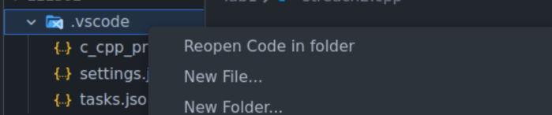

# NavigateDown

A very simple extension to remove one tiny annoyance.

### The Problem

When in VS code to open a folder you have to go to the file menu, select open folder, then find the folder you want in your file. Huge pain if the folder you want to open is in the same directery you are currently in.

### The Fix

*drumroll please...*

yep, thats it, just that simple button
